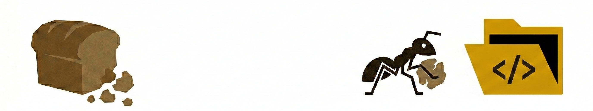

# MIGA - CLI

> **Bedrock Addon Utility Package Manager**
>
> A fast, zero-dependency CLI that bootstraps, builds, packages and manages
> Minecraft Bedrock Edition add-ons — written in Rust.

[](LICENSE)

<div style="text-align: center">

</div>

---

## Table of Contents

- [Overview](#overview)
- [Installation](#installation)
- [Commands](#commands)
    - [init](#init)
    - [add](#add)
    - [fetch](#fetch)
    - [run](#run)
    - [build](#build)
    - [remove](#remove)
- [Project structure](#project-structure)
- [Environment variables](#environment-variables)
- [Contributing](#contributing)
- [License](#license)

---

## Overview

`miga` replaces a full Node.js toolchain for Bedrock add-on development.
It handles:

- **Scaffolding** — creates a complete BP + RP project with typed TypeScript support.
- **TypeScript types** — downloads `.d.ts` files directly from the npm registry without
  requiring `npm` or `node` to be installed.
- **Registry modules** — fetches community modules from the miga registry and wires
  them into your project.
- **Compilation** — transpiles and optionally minifies/obfuscates TypeScript using
  [oxc](https://oxc.rs/) (native Rust, ~100× faster than `tsc`).
- **Packaging** — assembles `.mcpack` and `.mcaddon` archives ready for distribution.
- **Hot reload** — watches your source files and redeploys to Minecraft's dev pack
  folders on every save.

---

## Installation

### From source

```bash
git clone https://github.com/HormigaDev/miga.git
cd miga
cargo install --path .
```

### Pre-built binaries

Download the latest release from the
[Releases page](https://github.com/HormigaDev/miga-cli/releases) and place the binary
somewhere on your `PATH`.

---

## Commands

### `init`

Scaffold a new Bedrock add-on project interactively.

```bash
miga init [--namespace <ns>] [--name <name>]
```

**Options**

| Flag          | Description                                                    |
| ------------- | -------------------------------------------------------------- |
| `--namespace` | Namespace prefix used inside the add-on (e.g. `woc`).          |
| `--name`      | Internal identifier for the add-on (e.g. `ecological-spawns`). |

Any missing options are asked interactively. The command creates a directory named
after the add-on containing a full BP/RP skeleton with TypeScript support.

---

### `add`

Add a `@minecraft/*` type package from the npm registry.

```bash
miga add <package[@version]> [<package[@version]> ...]
```

**Examples**

```bash
miga add @minecraft/server@2.4.0
miga add @minecraft/server @minecraft/common
```

Types are downloaded to `.miga_modules/` and the package is recorded in
`.miga/miga.json`.

---

### `fetch`

Install one or more modules from the **miga registry**.

```bash
miga fetch <module> [<module> ...]
```

Modules are downloaded, extracted and registered in `.miga/modules.lock`.
Transitive dependencies are resolved automatically.

---

### `run`

Watch for source changes and hot-reload the add-on into Minecraft.

```bash
miga run [--obfuscate]
```

| Flag          | Description                                          |
| ------------- | ---------------------------------------------------- |
| `--obfuscate` | Minify and obfuscate the compiled JavaScript output. |

`miga run` compiles TypeScript on every change and copies the packs to the
paths configured in `.env` (`BEHAVIOR_PACKS_PATH` / `RESOURCE_PACKS_PATH`).

---

### `build`

Compile and package the add-on.

```bash
miga build [--obfuscate]
```

Outputs:

| File                    | Description                    |
| ----------------------- | ------------------------------ |
| `dist/<name>-bp.mcpack` | Behavior Pack only.            |
| `dist/<name>-rp.mcpack` | Resource Pack only.            |
| `dist/<name>.mcaddon`   | Combined archive (both packs). |

---

### `remove`

Remove an installed registry module.

```bash
miga remove <module>
```

Deletes the module files and removes it from `.miga/modules.lock`.

---

## Project structure

After running `miga init`, the project looks like:

```
<addon-name>/
├── behavior/               Behavior Pack
│   ├── manifest.json
│   ├── pack_icon.png       Replace with your own icon
│   ├── LICENSE
│   └── scripts/
│       ├── index.ts        Entry point
│       ├── config/
│       │   └── registry.ts Central registry / namespace
│       ├── events/
│       │   └── index.ts
│       ├── components/
│       ├── features/
│       └── core/
├── resource/               Resource Pack
│   ├── manifest.json
│   ├── pack_icon.png
│   ├── LICENSE
│   ├── texts/              en_US.lang, es_ES.lang, pt_BR.lang
│   ├── textures/
│   │   ├── blocks/
│   │   ├── items/
│   │   ├── entity/
│   │   └── ui/
│   ├── models/
│   ├── sounds/
│   └── ui/
├── .miga/
│   ├── miga.json           Project manifest (name, version, modules)
│   └── modules.lock        Installed module lock file
├── .env                    Deploy paths (not committed)
├── .env.template           Template to share with collaborators
├── .gitignore
├── tsconfig.json
├── LICENSE
└── README.md
```

---

## Environment variables

Configure `.env` (copy from `.env.template`):

```dotenv
# Absolute path to Minecraft's development_behavior_packs folder
BEHAVIOR_PACKS_PATH=

# Absolute path to Minecraft's development_resource_packs folder
RESOURCE_PACKS_PATH=

# true = inline source maps (debugging only)
SOURCE_MAPS=false
```

On Linux the default paths are auto-detected via `$HOME`. On Windows they point
to `%LOCALAPPDATA%\Packages\Microsoft.MinecraftUWP_*`. If the path is not found,
miga will warn and skip the copy step.

---

## Contributing

See [CONTRIBUTING.md](CONTRIBUTING.md).

---

## License

`miga` is free software released under the
[GNU General Public License v3.0](LICENSE).
